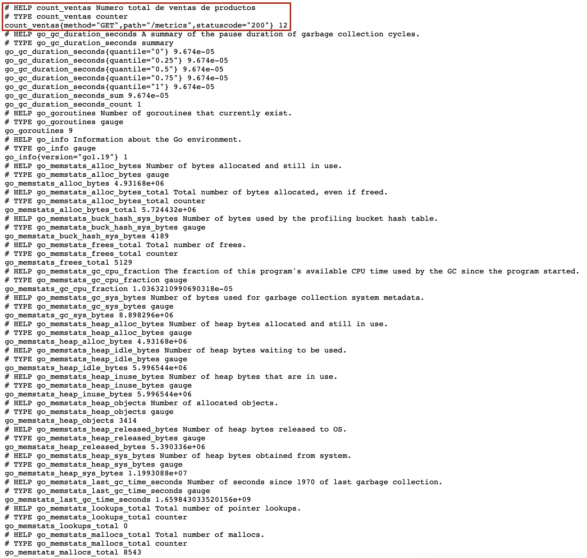
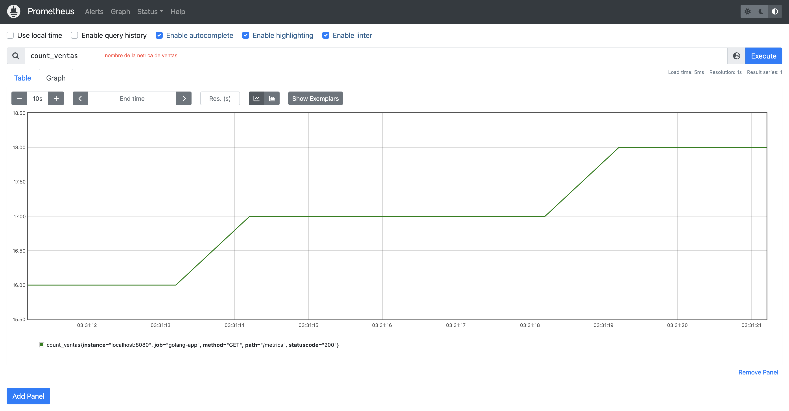

# Golang - Prometheus

Esta PoC se basa en generar metricas de tipo `count` para los endpoints de esta aplicacion Golang. 
Estas metricas seran consumidas por [Prometheus](https://prometheus.io) y mostradas en [Grafana](https://grafana.com). 
Las metricas de esta aplicacion, seran analizadas y procesadas por un modelo de prediccion se series 
de tiempo en Python con [SciKit-Learn](https://scikit-learn.org/stable/). Mostraran la serie de tiempo real,
la serie de tiempo ajustada y la prediccion de los valores a traves de Grafana. 

### Ejecucion de la aplicacion

Para ejecutar esta aplicacion, se debe ejecutar a traves de un terminal el comando:
``` 
./go-middleware-metrics
```
Esta aplicacion, tendra expuestos sus endpoints en el puerto 8080

### Flujo de funcionamiento aplicacion

- Esta aplicacion expone el endpoint `/metrics` a traves del cual Prometheus hara scrapping a traves del endpoint `/metrics`
- Al invocar los endpoints estos generaran contadores en el formato de extraccion de Prometheus

  - Endpoint scrapping metricas prometheus
    ```
    curl --location --request GET 'localhost:8080/metrics'
    ```

  - Endpoint de simulacion de venta de TV
    ```
    curl --location --request GET 'localhost:8080/venta/tv'
    ```

  - Endpoint de simulacion de venta de computadores
    ```
    curl --location --request GET 'localhost:8080/venta/computador'
    ```

### Prometheus
Prometheus almacenara metricas de tipo `count` y `gauge` generadas por esta aplicacion. 
Se asume que la version a utilizar de Prometheus es `prometheus-2.37.0.darwin-amd64`.

Para levantar Prometheus se debe:

- descargar Prometheus desde la [pagina oficial de descarga](https://prometheus.io/download/)
- desde la carpeta de descarga de Prometheus:
  - reemplazar el archivo original `prometheus.yaml` con el archivo `prometheus.yaml` de este proyecto
  - ejecutar `./prometheus` para iniciar la instancia de Prometheus

Al consultar manualmente el endpoint de metricas expuesto por esta aplicacion, se apreciaran las metricas:


Una vez realizados los pasos anteriores, prometheus hara scrapping de las metricas generadas por esta aplicacion, a traves del endpoint `/metrics`
Las metricas, seran mostradas de la siguente forma, dentro de la consola de Prometheus
